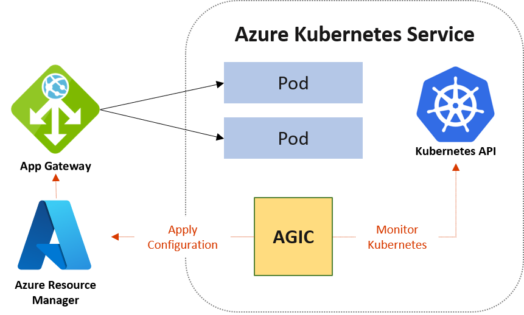

# nginx-mastery

```sh
-----BEGIN CERTIFICATE-----
(Leaf certificate – issued to your domain)
-----END CERTIFICATE-----

-----BEGIN CERTIFICATE-----
(Intermediate certificate – issued by the root)
-----END CERTIFICATE-----

-----BEGIN CERTIFICATE-----
(Another intermediate, if needed)
-----END CERTIFICATE-----
```

c2id-net-chain.pem
```pem

-----BEGIN CERTIFICATE-----
MIIFxzCCBK+gAwIBAgIQDxEnQP9V4TD2FDGoVvL9HTANBgkqhkiG9w0BAQsFADA8
MQswCQYDVQQGEwJVUzEPMA0GA1UEChMGQW1hem9uMRwwGgYDVQQDExNBbWF6b24g
UlNBIDIwNDggTTAyMB4XDTI0MTIzMTAwMDAwMFoXDTI2MDEyOTIzNTk1OVowEzER
MA8GA1UEAxMIYzJpZC5uZXQwggEiMA0GCSqGSIb3DQEBAQUAA4IBDwAwggEKAoIB
AQDFlZYXeLRbBQY/MFFCOyp2443hr4lQSjdjPX2A6femt9IrrtI95ew1snb1RXtP
94HUhTiJ2v+eaHj3WuALSWQJyrnClQew/+9zPgjCJO/HDHjZqNRL12yG17lAqYFi
Dj81pVdklU/VKaAc7aC2+QaYNE7Ah6GtYP+VdgubUouxtRRfRKcaYIePVkk7khK+
uPJdjvsUnpbqG05WZSAvOKavJqtGIfNrTdbTq2yJFC/cj6y/vb8AZ1+cSzDPx8oH
U8H3bbkXm131shKqSzeqjgXD9URsr80f4EL1fDR2UmNVzlfTPdXZieW3AzcmiwUO
F/Z2VqwXicwTHw3FqBtZuKjRAgMBAAGjggLsMIIC6DAfBgNVHSMEGDAWgBTAMVLN
WlDDgnx0cc7L6Zz5euuC4jAdBgNVHQ4EFgQUjgqoSUhfse5ekfOojci+uJUZClMw
HwYDVR0RBBgwFoIIYzJpZC5uZXSCCiouYzJpZC5uZXQwEwYDVR0gBAwwCjAIBgZn
gQwBAgEwDgYDVR0PAQH/BAQDAgWgMB0GA1UdJQQWMBQGCCsGAQUFBwMBBggrBgEF
BQcDAjA7BgNVHR8ENDAyMDCgLqAshipodHRwOi8vY3JsLnIybTAyLmFtYXpvbnRy
dXN0LmNvbS9yMm0wMi5jcmwwdQYIKwYBBQUHAQEEaTBnMC0GCCsGAQUFBzABhiFo
dHRwOi8vb2NzcC5yMm0wMi5hbWF6b250cnVzdC5jb20wNgYIKwYBBQUHMAKGKmh0
dHA6Ly9jcnQucjJtMDIuYW1hem9udHJ1c3QuY29tL3IybTAyLmNlcjAMBgNVHRMB
Af8EAjAAMIIBfQYKKwYBBAHWeQIEAgSCAW0EggFpAWcAdgAOV5S8866pPjMbLJkH
s/eQ35vCPXEyJd0hqSWsYcVOIQAAAZQbVUeBAAAEAwBHMEUCIQDXpHjUGOjONprP
T21IwaJ/wWQeyLjvu5YoukkfGp65CQIgLI4BzW7p9m/dCywZYEA1fKoBP+C0QJQ4
qtjGTYjjTrYAdgBkEcRspBLsp4kcogIuALyrTygH1B41J6vq/tUDyX3N8AAAAZQb
VUehAAAEAwBHMEUCIG6jcaMY+oGYFOR82PdwLZRz/An4AS76Ayx1W6SZl+YdAiEA
8vOZqSbnVOsjuzu3AKp9TcBgGZM/pmxMMHyRAVuU1tsAdQBJnJtp3h187Pw23s2H
ZKa4W68Kh4AZ0VVS++nrKd34wwAAAZQbVUe2AAAEAwBGMEQCIEXkB0RWE83ktetq
gIeiX0aJPWwL6REy1//5U4f9W8TnAiAaTibudg/jKP5W8L7AinrB3lRZjfJ1r8n4
Llc1MX51tjANBgkqhkiG9w0BAQsFAAOCAQEAi2vwLcQNyuGMMDNJrr2m+72Cc4nU
ksLx7by+2o8dhUvCnMMMcOl+9z81C58lqfqB5fGpeg3B/JLTJVwbunzUmvR4iCjr
w4v+M9XkOijb7mmEyiVPqTD4N1OmIKcXmYY24sS3KqhQOXaO+NZ9mgwzhPvG1qby
wtBj6bpnabcpiSv1TLoApqflmZupq7vARCIfC4mU8yKRWp0mg+rKOIgIz0uqDr2F
KolLbCfLK1dGxB80ybtKMDdyXbq/qcxAUoFkAfG2BpS9GmoXjiv21sLDSJ1yyTDn
Jgd1cd1xz0Dj7hvjW07GAOVfA3wwMxtM3Cnds9G2uMPpEdh5kPGTQnZEZQ==
-----END CERTIFICATE-----
-----BEGIN CERTIFICATE-----
MIIEXjCCA0agAwIBAgITB3MSSkvL1E7HtTvq8ZSELToPoTANBgkqhkiG9w0BAQsF
ADA5MQswCQYDVQQGEwJVUzEPMA0GA1UEChMGQW1hem9uMRkwFwYDVQQDExBBbWF6
b24gUm9vdCBDQSAxMB4XDTIyMDgyMzIyMjUzMFoXDTMwMDgyMzIyMjUzMFowPDEL
MAkGA1UEBhMCVVMxDzANBgNVBAoTBkFtYXpvbjEcMBoGA1UEAxMTQW1hem9uIFJT
QSAyMDQ4IE0wMjCCASIwDQYJKoZIhvcNAQEBBQADggEPADCCAQoCggEBALtDGMZa
qHneKei1by6+pUPPLljTB143Si6VpEWPc6mSkFhZb/6qrkZyoHlQLbDYnI2D7hD0
sdzEqfnuAjIsuXQLG3A8TvX6V3oFNBFVe8NlLJHvBseKY88saLwufxkZVwk74g4n
WlNMXzla9Y5F3wwRHwMVH443xGz6UtGSZSqQ94eFx5X7Tlqt8whi8qCaKdZ5rNak
+r9nUThOeClqFd4oXych//Rc7Y0eX1KNWHYSI1Nk31mYgiK3JvH063g+K9tHA63Z
eTgKgndlh+WI+zv7i44HepRZjA1FYwYZ9Vv/9UkC5Yz8/yU65fgjaE+wVHM4e/Yy
C2osrPWE7gJ+dXMCAwEAAaOCAVowggFWMBIGA1UdEwEB/wQIMAYBAf8CAQAwDgYD
VR0PAQH/BAQDAgGGMB0GA1UdJQQWMBQGCCsGAQUFBwMBBggrBgEFBQcDAjAdBgNV
HQ4EFgQUwDFSzVpQw4J8dHHOy+mc+XrrguIwHwYDVR0jBBgwFoAUhBjMhTTsvAyU
lC4IWZzHshBOCggwewYIKwYBBQUHAQEEbzBtMC8GCCsGAQUFBzABhiNodHRwOi8v
b2NzcC5yb290Y2ExLmFtYXpvbnRydXN0LmNvbTA6BggrBgEFBQcwAoYuaHR0cDov
L2NydC5yb290Y2ExLmFtYXpvbnRydXN0LmNvbS9yb290Y2ExLmNlcjA/BgNVHR8E
ODA2MDSgMqAwhi5odHRwOi8vY3JsLnJvb3RjYTEuYW1hem9udHJ1c3QuY29tL3Jv
b3RjYTEuY3JsMBMGA1UdIAQMMAowCAYGZ4EMAQIBMA0GCSqGSIb3DQEBCwUAA4IB
AQAtTi6Fs0Azfi+iwm7jrz+CSxHH+uHl7Law3MQSXVtR8RV53PtR6r/6gNpqlzdo
Zq4FKbADi1v9Bun8RY8D51uedRfjsbeodizeBB8nXmeyD33Ep7VATj4ozcd31YFV
fgRhvTSxNrrTlNpWkUk0m3BMPv8sg381HhA6uEYokE5q9uws/3YkKqRiEz3TsaWm
JqIRZhMbgAfp7O7FUwFIb7UIspogZSKxPIWJpxiPo3TcBambbVtQOcNRWz5qCQdD
slI2yayq0n2TXoHyNCLEH8rpsJRVILFsg0jc7BaFrMnF462+ajSehgj12IidNeRN
4zl+EoNaWdpnWndvSpAEkq2P
-----END CERTIFICATE-----
-----BEGIN CERTIFICATE-----
MIIDQTCCAimgAwIBAgITBmyfz5m/jAo54vB4ikPmljZbyjANBgkqhkiG9w0BAQsF
ADA5MQswCQYDVQQGEwJVUzEPMA0GA1UEChMGQW1hem9uMRkwFwYDVQQDExBBbWF6
b24gUm9vdCBDQSAxMB4XDTE1MDUyNjAwMDAwMFoXDTM4MDExNzAwMDAwMFowOTEL
MAkGA1UEBhMCVVMxDzANBgNVBAoTBkFtYXpvbjEZMBcGA1UEAxMQQW1hem9uIFJv
b3QgQ0EgMTCCASIwDQYJKoZIhvcNAQEBBQADggEPADCCAQoCggEBALJ4gHHKeNXj
ca9HgFB0fW7Y14h29Jlo91ghYPl0hAEvrAIthtOgQ3pOsqTQNroBvo3bSMgHFzZM
9O6II8c+6zf1tRn4SWiw3te5djgdYZ6k/oI2peVKVuRF4fn9tBb6dNqcmzU5L/qw
IFAGbHrQgLKm+a/sRxmPUDgH3KKHOVj4utWp+UhnMJbulHheb4mjUcAwhmahRWa6
VOujw5H5SNz/0egwLX0tdHA114gk957EWW67c4cX8jJGKLhD+rcdqsq08p8kDi1L
93FcXmn/6pUCyziKrlA4b9v7LWIbxcceVOF34GfID5yHI9Y/QCB/IIDEgEw+OyQm
jgSubJrIqg0CAwEAAaNCMEAwDwYDVR0TAQH/BAUwAwEB/zAOBgNVHQ8BAf8EBAMC
AYYwHQYDVR0OBBYEFIQYzIU07LwMlJQuCFmcx7IQTgoIMA0GCSqGSIb3DQEBCwUA
A4IBAQCY8jdaQZChGsV2USggNiMOruYou6r4lK5IpDB/G/wkjUu0yKGX9rbxenDI
U5PMCCjjmCXPI6T53iHTfIUJrU6adTrCC2qJeHZERxhlbI1Bjjt/msv0tadQ1wUs
N+gDS63pYaACbvXy8MWy7Vu33PqUXHeeE6V/Uq2V8viTO96LXFvKWlJbYK8U90vv
o/ufQJVtMVT8QtPHRh8jrdkPSHCa2XV4cdFyQzR1bldZwgJcJmApzyMZFo6IQ6XU
5MsI+yMRQ+hDKXJioaldXgjUkK642M4UwtBV8ob2xJNDd2ZhwLnoQdeXeGADbkpy
rqXRfboQnoZsG4q5WTP468SQvvG5
-----END CERTIFICATE-----
```


## Alternatives to pem
- JSON Web Key (JWK / JWKS)
- JKS / Java Keystore
- PKCS#7 / P7B
- PFX / PKCS#12
- DER (Distinguished Encoding Rules)


`sbt dependencyTree`

`sbt dependencyTree > dependency-tree.txt`


Nimbus JOSE+JWT

OAuth 2.0 SDK with OpenID Connect Extensions

`/etc/nginx/nginx.conf`
```conf
user  nginx;
worker_processes auto;
worker_rlimit_nofile 200000;

events {
  use epoll;
  worker_connections 65535;
  multi_accept on;
}

http {
  # Core
  sendfile on;
  tcp_nopush on;
  tcp_nodelay on;
  keepalive_timeout 15;
  types_hash_max_size 4096;
  server_tokens off;

  # MIME & include sites
  include       /etc/nginx/mime.types;
  default_type  application/octet-stream;
  include       /etc/nginx/conf.d/*.conf;
  include       /etc/nginx/sites-enabled/*.conf;

  # Real IP (if behind another LB)
  # set_real_ip_from 10.0.0.0/8;
  # real_ip_header X-Forwarded-For;

  # Gzip (safe defaults)
  gzip on;
  gzip_comp_level 5;
  gzip_min_length 1024;
  gzip_proxied any;
  gzip_types text/plain text/css application/json application/javascript application/xml+rss application/xml text/javascript image/svg+xml;

  # (Optional) Brotli if module is available
  # brotli on; brotli_comp_level 5; brotli_types text/plain text/css application/json application/javascript application/xml image/svg+xml;

  # Caching
  proxy_cache_path /var/cache/nginx/proxy levels=1:2 keys_zone=STATIC:100m inactive=60m max_size=10g use_temp_path=off;

  # Logs: structured JSON
  log_format json_combined escape=json
    '{ "time":"$time_iso8601", "remote_addr":"$remote_addr", "request":"$request", "status":$status, '
    '"body_bytes":$body_bytes_sent, "referer":"$http_referer", "agent":"$http_user_agent", '
    '"upstream":"$upstream_addr", "upstream_status":"$upstream_status", "req_time":$request_time, "upstream_time":"$upstream_response_time", '
    '"host":"$host", "xff":"$http_x_forwarded_for" }';
  access_log /var/log/nginx/access.json json_combined;
  error_log  /var/log/nginx/error.log warn;

  # Limits & timeouts (protect upstreams)
  client_max_body_size 25m;
  client_body_timeout 15s;
  client_header_timeout 15s;
  send_timeout 15s;
  proxy_read_timeout 30s;
  proxy_connect_timeout 5s;
  proxy_send_timeout 15s;

  # Rate limiting (example zone used below)
  limit_req_zone $binary_remote_addr zone=api_rps:10m rate=10r/s;
  limit_conn_zone $binary_remote_addr zone=perip:10m;

  # Upstream pool
  upstream app_pool {
    least_conn;
    zone app_pool 64k;
    server 10.0.1.10:3000 max_fails=3 fail_timeout=10s;
    server 10.0.1.11:3000 max_fails=3 fail_timeout=10s;
    keepalive 64;
  }

  # Status (protect in prod or expose via sidecar)
  server {
    listen 127.0.0.1:8080;
    location /nginx_status { stub_status; allow 127.0.0.1; deny all; }
  }
}

```

Secure site with TLS, HTTP/2 (+ optional HTTP/3)
/etc/nginx/sites-enabled/example.conf

```conf
# Redirect HTTP→HTTPS
server {
  listen 80;
  listen [::]:80;
  server_name example.com www.example.com;
  return 301 https://example.com$request_uri;
}

# Primary HTTPS server
server {
  listen 443 ssl http2;                # HTTP/2
  # Optional HTTP/3/QUIC (requires nginx build with quic + OpenSSL/quictls/BoringSSL)
  # listen 443 quic reuseport;         # HTTP/3
  listen [::]:443 ssl http2;

  server_name example.com;

  # TLS
  ssl_certificate /etc/letsencrypt/live/example.com/fullchain.pem;
  ssl_certificate_key /etc/letsencrypt/live/example.com/privkey.pem;
  ssl_session_timeout 1d;
  ssl_session_cache shared:SSL:50m;
  ssl_protocols TLSv1.2 TLSv1.3;
  ssl_ciphers HIGH:!aNULL:!MD5;
  ssl_prefer_server_ciphers off;

  # OCSP stapling
  ssl_stapling on;
  ssl_stapling_verify on;
  resolver 1.1.1.1 8.8.8.8 valid=300s;
  resolver_timeout 5s;

  # Security headers (adjust CSP for your app)
  add_header Strict-Transport-Security "max-age=31536000; includeSubDomains; preload" always;
  add_header X-Content-Type-Options nosniff always;
  add_header X-Frame-Options DENY always;
  add_header Referrer-Policy strict-origin-when-cross-origin always;
  add_header Permissions-Policy "geolocation=(), camera=(), microphone=()" always;
  # add_header Content-Security-Policy "default-src 'self'; script-src 'self'; style-src 'self'; object-src 'none'" always;

  # (HTTP/3 advertisement)
  # add_header Alt-Svc 'h3=":443"; ma=86400';

  # Proxy defaults
  proxy_set_header Host              $host;
  proxy_set_header X-Real-IP         $remote_addr;
  proxy_set_header X-Forwarded-For   $proxy_add_x_forwarded_for;
  proxy_set_header X-Forwarded-Proto $scheme;

  # Serve static assets directly with cache
  location /assets/ {
    root /var/www/example;                   # files in /var/www/example/assets
    expires 30d;
    access_log off;
    add_header Cache-Control "public, max-age=2592000, immutable";
  }

  # Cacheable upstream responses (e.g., SSR pages, APIs with ETags)
  location / {
    proxy_pass http://app_pool;
    proxy_http_version 1.1;
    proxy_set_header Connection "";
    proxy_buffering on;
    proxy_buffers 64 8k;
    proxy_busy_buffers_size 256k;

    # Edge caching for GET/HEAD (tune keys)
    proxy_cache STATIC;
    proxy_cache_key "$scheme$proxy_host$request_uri";
    proxy_cache_valid 200 302 10m;
    proxy_cache_valid 404 1m;
    proxy_cache_bypass $http_cache_control;  # allow Cache-Control: no-cache to bypass
    add_header X-Cache-Status $upstream_cache_status always;

    # Rate limits & conns (protect your API paths more aggressively)
    limit_conn perip 50;
  }

  # Stricter API limits example
  location /api/ {
    proxy_pass http://app_pool;
    limit_req zone=api_rps burst=20 nodelay;
    limit_conn perip 20;
  }

  # Health probe endpoint (surface upstream health)
  location = /healthz {
    access_log off;
    add_header Content-Type text/plain;
    return 200 "ok\n";
  }

  # Deny hidden files
  location ~ /\.(?!well-known) {
    deny all;
  }

  # Error pages
  error_page 502 503 504 /50x.html;
  location = /50x.html { root /usr/share/nginx/html; }
}
```

`docker run -d --name nginx --rm -p 80:80 nginx:latest`

AWS and other cloud providers have loadbalancers,so why do I need an nginx reverse proxy?
In practice you want to use both
- you would have your cloud loadbalancer outside of your servers, as an entry point into your private network
 - You would then use reverse proxy to route traffic within your network
 - reverse proxy can handle ssl termination

- A cloud load balancer doesn’t know Kubernetes internals — it only knows which `Ingress Controller` Service to send traffic to.
- The `Ingress Controller` inside Kubernetes then does the smart routing to Services/Pods.
- Together, they form a chain of reverse proxies managing external and internal traffic.

### Ingress
Make your HTTP (or HTTPS) network service available using a protocol-aware configuration mechanism, that understands web concepts like URIs, hostnames, paths, and more. The Ingress concept lets you map traffic to different backends based on rules you define via the Kubernetes API.

An API object that manages external access to the services in a cluster, typically HTTP.
Ingress may provide load balancing, SSL termination and name-based virtual hosting.

```sh
Ingress exposes HTTP and HTTPS routes from outside the cluster to services within the cluster. Traffic routing is controlled by rules defined on the Ingress resource.
```


### Common Ingress Controllers
- NGINX Ingress Controller :Built on NGINX (open-source reverse proxy and load balancer).
- HAProxy Ingress: Based on HAProxy, a high-performance TCP/HTTP load balancer.
- Traefik
- Kong Ingress Controller: Based on Kong API Gateway.


## What is Application Gateway Ingress Controller?
The Application Gateway Ingress Controller (AGIC) is a Kubernetes application, which makes it possible for Azure Kubernetes Service (AKS) customers to leverage Azure's native Application Gateway L7 load-balancer to expose cloud software to the Internet.AGIC monitors the Kubernetes cluster it's hosted on and continuously updates an Application Gateway, so that selected services are exposed to the Internet

The Ingress Controller runs in its own pod on the customer’s AKS. AGIC monitors a subset of Kubernetes Resources for changes. The state of the AKS cluster is translated to Application Gateway specific configuration and applied to the Azure Resource Manager 

 Application Gateway talks to pods using their private IP address directly and doesn't require NodePort or KubeProxy services.

 

### Real-World Scenarios for Ingress Controllers
- General-purpose web applications (SaaS, internal apps)
Best fit: NGINX Ingress Controller
Why:
Battle-tested, widely supported, huge community.
Handles most typical web workloads (HTTP, HTTPS, routing, TLS).
Example: A SaaS company running multiple microservices (/auth, /billing, /dashboard) behind one domain.

- High-performance, low-latency apps (e.g., trading platforms, streaming)
Best fit: HAProxy Ingress
Why:
Extremely fast and reliable under heavy load.
Optimized for TCP/UDP + HTTP traffic.
Example: A stock trading system needing <10ms latency on requests.

- API-first platforms (public APIs, developer products)
Best fit: Kong Ingress Controller
Why:
Acts as an API gateway (auth, rate limiting, logging, plugins).
Good for enterprises where APIs are central.
Example: A company exposing APIs for payments, shipping, or identity verification.

ingress controller-> reverse proxy for kubernetes


`Frameworks like Express, http4s, and Spring Boot are best thought of as application servers rather than general-purpose web servers`

#### Application Server (e.g., Express, http4s, Spring Boot)
- Focuses on application/business logic: request routing, parsing JSON, applying middleware, database integration, user authentication, domain rules.
- Runs inside a runtime (Node.js VM for Express, JVM for http4s/Spring).

Express, http4s, Spring Boot = Application Servers
Nginx, Apache HTTPD, Caddy = Web Servers (often used as reverse proxies/load balancers in front of the app servers)

Some timeouts are per-connection (Nginx) vs per-request (http4s Timeout.httpApp).


### Layer 4 Load Balancers
Treat connections as streams of packets.
Make decisions on the connection level, not individual requests.
Examples:
“Forward all TCP packets from client port 443 to backend X.”
No knowledge of what’s inside (HTTP request, SMTP, etc.).


### Layer 7 Load Balancers
Parse application-level messages (e.g., HTTP GET /api/users).
Can apply logic per request, not just per connection.
Can handle multiple requests over a single TCP connection (HTTP keep-alive).

Layer 4: Only sees the TCP session; SSL is opaque. It can’t terminate TLS because it doesn’t possess the private keys or parse the encryption handshake.
Layer 7: Terminates SSL/TLS, decrypts payload, inspects HTTP contents, then can:
Forward plain HTTP to backend (SSL termination).
Re-encrypt with a different certificate (SSL bridging).

```sh
| Algorithm Type                       | Layer 4 | Layer 7 |
| ------------------------------------ | ------- | ------- |
| Round Robin                          | ✅       | ✅      |
| Least Connections                    | ✅       | ✅      |
| IP Hash                              | ✅       | ✅      |
| Header/URL-based Routing             | ❌       | ✅      |
| Cookie-based Session Persistence     | ❌       | ✅      |
| Content-based Distribution           | ❌       | ✅      |
| Geolocation / User Agent routing.    | ❌       | ✅      |
```

A load balancer focuses on where a request goes.
An API gateway focuses on how a request is handled.